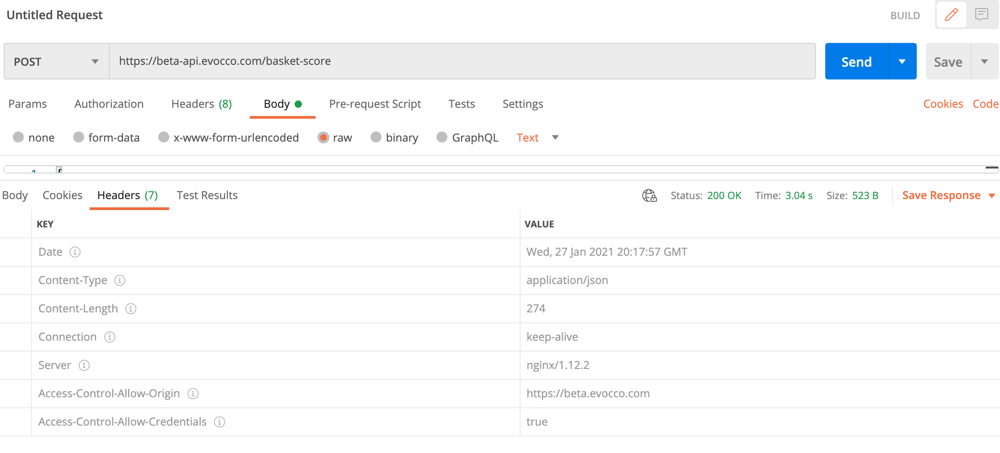

## Endpoints >> /basket_score

*POST https://beta-api.evocco.com/basket-score*

**Description**: It send the valid api_key and list of food products in the JSON format.

**Example: Making a post request**
```{ 
    "api_key" : "YOUR_API_KEY" ,
    "products":["Apple","Mango"]
}
```



**POST Parameter**: N/A


## Responses & Errors
Below are templates of the responses the basket-score API returns.

1. Products
2. Errors

### Products reponses

```{
"basket_breakdown": [
    {
        "co2_impact": 82.0,
        "food_unit": 0.6,
        "product_name": "apple",
        "score": 135.57
    },
    {
        "co2_impact": 817.0,
        "food_unit": 0.61,
        "product_name": "mango",
        "score": 1344.27
    }
],
"num_identified_items": 2,
"overall_co2_impact": 899.0,
"overall_food_unit": 1.21,
"overall_score": 739.92
}
```


### Error response

```{
"message": "Invalid Key"
}
```

